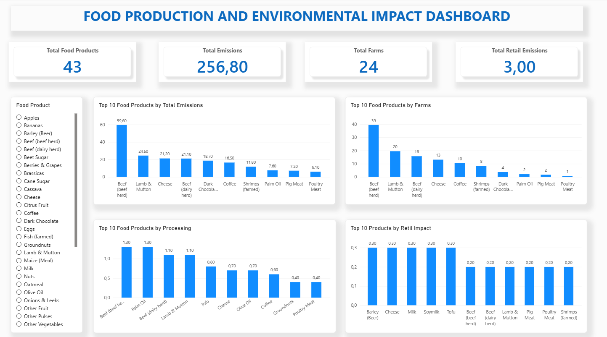

# Food-Production-Environmental-Impact-Dashboard
Power BI dashboard analyzing food production, emissions, farms, processing and retail environmental impact.
# Food Production & Environmental Impact Dashboard

## 📊 Project Overview

This project is an interactive Power BI dashboard designed to analyse food production and its environmental impact.

The dashboard provides a visual analysis of food products across key environmental and production-related metrics, helping users understand differences between products and identify areas with higher environmental impact.

## 🎯 Project Objectives

- Analyse total environmental emissions across food products
- Compare food products based on emissions
- Analyse the number of farms associated with each food product
- Examine processing-related environmental impact
- Analyse retail-related environmental impact
- Create an interactive dashboard for data exploration and reporting

## 📈 Dashboard KPIs

The dashboard currently includes:

- **Total Food Products:** 43
- **Total Emissions:** 256.80
- **Total Farms:** 24
- **Total Retail Emissions:** 3.00

The Food Product slicer allows users to select an individual product and analyse its related environmental metrics.

## 📊 Dashboard Visualisations

The dashboard includes:

- Top 10 Food Products by Total Emissions
- Top 10 Food Products by Farms
- Top 10 Food Products by Processing
- Top 10 Products by Retail Impact
- Interactive Food Product slicer
- KPI cards for key metrics

## 🛠️ Tools & Technologies

- Power BI
- DAX
- Data Analysis
- Data Visualisation
- Data Modelling
- Dashboard Development
- Microsoft Excel

## 🌱 Environmental Impact

The dataset contains environmental impact measurements associated with food production.

The emissions metric represents greenhouse-gas impact expressed as CO₂-equivalent (CO₂e), allowing different greenhouse gases to be represented using a common measurement.

The analysis considers different stages and environmental factors associated with food production, including farming, processing, transport and retail.

## 🔍 Key Analytical Areas

The dashboard can be used to investigate questions such as:

- Which food products have the highest emissions?
- Which products are associated with the most farms?
- Which products have higher processing impacts?
- Which products have higher retail impacts?
- How does selecting a specific food product affect the overall metrics?

## 💡 Skills Demonstrated

This project demonstrates practical experience in:

- Data cleaning and preparation
- Data analysis
- Data modelling
- DAX measures
- KPI development
- Data visualisation
- Interactive dashboard design
- Business-oriented reporting
- Environmental data analysis

## 📷 Dashboard Preview

## 📁 Project Files

The repository will contain:

- Power BI dashboard (.pbix)
- Dashboard screenshot
- Project documentation

## 👤 Author

**Malotse Mathipa**

Data Analyst | Data Science Practitioner

GitHub: [Malotse](https://github.com/Malotse)

---

⭐ This project is part of my growing Data Analytics and Data Science portfolio.
